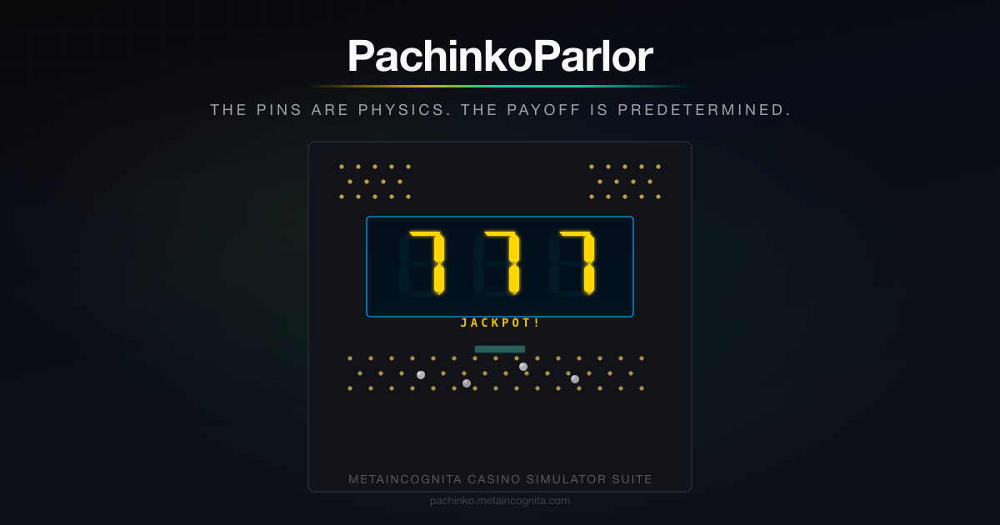

# PachinkoParlor



**Live:** [pachinko.metaincognita.com](https://pachinko.metaincognita.com)

A physics-based pachinko simulator for the [Metaincognita](https://metaincognita.com) casino simulator suite. PachinkoParlor faithfully reproduces a modern Japanese "Digipachi" pachinko machine with real-time ball physics (Matter.js via Phaser 3), a digital lottery system, and a full mode system. The simulator exposes the mathematical reality behind pachinko: the physical pin field creates the *experience*; a hidden RNG creates the *result*.

*The pins are physics. The payoff is predetermined.*

---

## The Simulator

PachinkoParlor models both systems that define modern Digipachi:

1. **The Physical Board** — a vertical playing field of 200+ brass pins through which steel balls cascade under gravity, simulated in real-time with Matter.js physics. Ball paths are genuinely chaotic, with micro-variance on every launch.

2. **The Digital Lottery** — when a ball enters the start chakker, it triggers a 3-reel slot display rendered with authentic 7-segment LED digits. The RNG determines the outcome before the animation plays. Jackpots trigger payout mode with timed rounds.

### Features

- Real-time ball physics with configurable gravity (Slow / Normal / Fast)
- Masamura gauge pin field (procedurally generated offset grid)
- 7-segment LED lottery display with attract mode, reach animations, and jackpot flash
- Start chakker sensor with visual feedback (+3 balls, SPIN! indicator)
- Payout gate (opens for 10 rounds on jackpot, 2 on koatari)
- Tulip toggle gates with mechanical wing animation
- Rotary launcher dial (keyboard, mouse, touch)
- Launch micro-variance (position, velocity, angle jitter per ball)
- Ball economy with virtual yen (¥4/ball purchase, ¥2.5/ball exchange)
- Bankroll management (buy balls, cash out, balance tracking)
- Statistical analysis (jackpot rate, reach count, drought tracking, burn rate, cost/hour)
- Lifetime stats persisted in localStorage
- Contextual hints guiding new players
- Stuck ball detection and auto-nudge
- Metaincognita dark-mode design system

---

## Development

### Prerequisites

- Node.js 20.x LTS (see `.nvmrc`)
- Yarn package manager

### Setup

```bash
nvm use
yarn install
yarn dev          # http://localhost:5173
```

### Commands

| Command | Description |
|---|---|
| `yarn dev` | Start development server with HMR |
| `yarn build` | TypeScript check + production build to `dist/` |
| `yarn preview` | Preview production build locally |
| `yarn test` | Run unit tests (Vitest) |
| `yarn test:watch` | Run tests in watch mode |
| `yarn typecheck` | TypeScript type checking only |
| `yarn lint` | ESLint |

### Production Build

```bash
yarn build
# Output: dist/ (~330KB gzipped)
#   - phaser chunk: ~320KB gzipped
#   - app code: ~12KB gzipped
```

### Deploy

Deployed to Netlify as a static SPA. The `netlify.toml` configures build, redirects, security headers (CSP, X-Frame-Options, HSTS), and aggressive caching for hashed assets.

```bash
# Netlify CLI
netlify deploy --prod
```

---

## Tech Stack

| Layer | Technology | Version |
|---|---|---|
| Game engine | Phaser 3 | 3.90.0 (pinned) |
| Physics | Matter.js | Bundled with Phaser |
| Build tool | Vite | 8.x (Rolldown bundler) |
| Language | TypeScript | 5.x (strict mode) |
| Testing | Vitest | 4.x |
| Linting | ESLint + @typescript-eslint | 10.x / 8.x |
| Formatting | Prettier | 3.x |
| Deploy | Netlify | Static SPA |
| Package manager | Yarn | Suite convention |

---

## Architecture

PachinkoParlor uses a **split architecture**: the game canvas runs in Phaser 3, all surrounding UI is vanilla TypeScript + DOM manipulation. The two layers communicate through a typed event bridge.

```
DOM Layer (TypeScript + HTML/CSS)
  Setup Screen  |  Game Screen          |  History (Phase 4)
                |  Phaser Canvas + DOM  |  Analysis (Phase 4)
                |  Stats Column (DOM)   |
                |                       |
                |    GameBridge         |
                |   (typed events)      |
```

Phaser renders ONLY inside `<div id="game-container">`. All surrounding UI — setup screen, stats column, top bar — is standard DOM styled with the shared Metaincognita CSS custom properties.

### Project Structure

```
src/
  main.ts                    App entry point
  config.ts                  Phaser game configuration

  views/                     DOM-based views (NOT Phaser scenes)
    SetupView.ts             Setup screen
    GameView.ts              Game screen (mounts Phaser canvas)
    ViewManager.ts           View navigation

  scenes/                    Phaser scenes (game canvas only)
    BootScene.ts             Asset preloading
    BoardScene.ts            Main physics + game loop

  physics/                   Matter.js physics
    PinField.ts              Masamura gauge pin generator
    BallPool.ts              Ball object pooling + stuck detection
    PhysicsConfig.ts         Runtime tuning parameters

  input/
    LauncherDial.ts          Rotary dial (keyboard, mouse, touch)

  gates/                     Board gate components
    StartChakker.ts          Center gate sensor (triggers lottery)
    PayoutGate.ts            Bottom payout gate (opens on jackpot)
    TulipGate.ts             Toggle wing gates
    SidePocket.ts            Side drain pockets

  lottery/                   Digital lottery system
    LotteryEngine.ts         RNG, probability, spin queue
    LotteryDisplay.ts        7-segment LED reel animation
    ReachSystem.ts           Reach timing configuration
    SpinResult.ts            Outcome type definitions

  state/
    GameStateMachine.ts      IDLE → NORMAL → SPINNING → PAYOUT

  economy/
    BallEconomy.ts           Ball tracking, purchasing, stats, localStorage

  ui/                        DOM UI components
    StatsColumn.ts           Stats panel (bankroll, spins, analysis)
    TopBar.ts                Navigation + branding
    DevPanel.ts              Physics tuning (press D)

  layouts/
    default.json             Masamura gauge board layout

  utils/
    constants.ts             Collision categories, dimensions
    bridge.ts                Phaser ↔ DOM typed event bus

  types/
    physics.ts               Physics tuning interface
    layout.ts                Board layout JSON schema
    state.ts                 Game state enum
    economy.ts               Economy types + constants
```

---

## How to Play

1. **Set your power** — press right arrow to increase the launcher dial. The sweet spot is 40-70% (the stats panel will tell you).
2. **Fire balls** — hold Space or click-drag the dial. Balls enter the pin field from the top and cascade through the pins.
3. **Hit the chakker** — balls that reach the teal center gate trigger a lottery spin on the LCD. Each entry also awards 3 balls.
4. **Watch the reels** — three 7-segment digits spin and stop. If two match, it's a REACH (suspense pause). If all three match — JACKPOT.
5. **Payout mode** — on jackpot, the bottom gate opens for 10 rounds. Aim balls into it for 15 balls per entry.
6. **Manage your bankroll** — buy more balls (¥1,000 per 250) or cash out at the exchange rate (¥2.5/ball).
7. **Watch the stats** — your actual jackpot rate, burn rate, and net P&L tell the real story.

### Controls

| Input | Action |
|---|---|
| Left/Right arrows | Adjust dial power |
| Hold Space | Fire balls |
| Mouse wheel | Fine dial adjustment |
| Click + drag dial | Aim and fire |
| D | Toggle physics dev panel |

---

## Glossary

| Term | Japanese | Meaning |
|---|---|---|
| **Digipachi** | デジパチ | Modern digital pachinko with LCD lottery display. The dominant machine type since the 1990s. |
| **Hane-mono** | 羽根物 | Classic analog pachinko without digital lottery. Purely mechanical — the original form. |
| **Start Chakker** | スタートチャッカー | Center gate that triggers a lottery spin when a ball enters. The most important target on the board. |
| **Kakuhen** | 確変 (確率変動) | "Probability change" — fever mode. Jackpot odds multiplied ~10x after a jackpot. The emotional peak. |
| **Jitan** | 時短 (時間短縮) | "Time reduction" — fast-cycle mode with accelerated spins and widened chakker. A wind-down after fever. |
| **Koatari** | 小当たり | "Small hit" — a brief jackpot with only 2 payout rounds and short gate opening. |
| **Ōatari** | 大当たり | "Big hit" — full jackpot. Three matching symbols. The goal. |
| **Reach** | リーチ | 2 of 3 reels match — suspense animation plays before the third reel stops. Most reaches miss. |
| **Super Reach** | スーパーリーチ | Extended reach with dramatic animation. Higher jackpot conversion rate (~30%). |
| **Premium Reach** | プレミアムリーチ | Rare, elaborate reach sequence. Highest conversion rate (~60%+). |
| **Masamura Gauge** | 正村ゲージ | Standard Japanese pin arrangement pattern, invented in the 1950s by nail technician Masamura. |
| **Tulip Gate** | チューリップ | Mechanical wing gate that toggles open/closed. Named for its flower-like shape when open. |
| **Payout Gate** | アタッカー | Large gate at the bottom that opens during jackpot rounds. "Attacker" in Japanese. |
| **Three-Shop System** | 三店方式 | The legal fiction enabling cash gambling: parlor → prize counter → exchange shop → cash. |
| **Pachi Puro** | パチプロ | Professional pachinko player. Exploits machine selection and timing, not the math. |
| **CR Machine** | CR機 | "Card Reader" machine — modern pachinko accepting prepaid cards instead of cash. |
| **Nail Reading** | 釘読み | The skill of reading pin adjustments to identify favorably set machines. |
| **Santen Hōshiki** | 三店方式 | The three-shop system (see above). |
| **Korinto Gēmu** | コリントゲーム | "Corinth game" — the Western bagatelle that was pachinko's ancestor, arriving in Japan in the 1920s. |
| **Ryōzanpaku** | 攻略雑誌 | Pachinko strategy publications compiling machine analysis and payout data for pachi puro. |

---

## Roadmap

- [x] **Phase 1** — Physics board, ball launcher, pin field, dial input
- [x] **Phase 2** — Gates, pockets, digital lottery, game state machine, ball economy
- [ ] **Phase 3** — Kakuhen (fever mode), jitan, koatari, full state machine
- [ ] **Phase 4** — Statistics dashboard, probability charts, RNG transparency mode
- [ ] **Phase 5** — Themes (Classic Gold, Neon Drift), audio, accessibility, responsive layout

---

## License

MIT

---

## Stats & Analysis

The stats column provides real-time insight into the mathematics the game's sensory design is built to hide.

### Bankroll

| Stat | Description |
|---|---|
| **Balls in tray** | Current ball count with color-coded bar (green → gold → red) |
| **Balance** | Virtual yen remaining to spend (starts at ¥10,000) |
| **Spent** | Total virtual yen spent on ball purchases |
| **Cash-out value** | What your current balls are worth at the exchange rate (¥2.5/ball — always less than purchase price) |
| **Net P&L** | Cash-out value minus total spent. The bottom line. Almost always negative. |

### Statistics

| Stat | Description | Why It Matters |
|---|---|---|
| **Spins** | Total lottery spins triggered | Volume indicator |
| **Jackpots** | Total jackpots hit | The rare wins |
| **Jackpot rate** | Actual jackpots / total spins as percentage | Compare to expected 0.31% (1/319). Convergence over time demonstrates the law of large numbers. |
| **Reaches** | Times 2 of 3 reels matched (suspense animation) | Shows the manufactured drama — most reaches don't convert |
| **Drought** | Current spins since last jackpot | The gambler's fallacy in real-time — this number doesn't affect your odds |
| **Longest drought** | Maximum spins between any two jackpots | Variance can be brutal |
| **Burn rate** | Balls lost per minute (rolling 2-min average) | How fast you're bleeding |
| **Cost/hour** | Burn rate extrapolated to yen per hour | "You're spending ¥8,400/hour" hits differently than "35 balls per minute" |
| **Session time** | Elapsed play time | Time awareness — parlors are designed to make you lose track |

### Lifetime (Persisted)

Session-to-session totals stored in localStorage: total sessions played, total yen spent, total spins, total jackpots. The cumulative picture across all visits.

---

## About Pachinko

Pachinko is Japan's most popular form of gambling — a ¥20 trillion industry that employs hundreds of thousands and occupies more floor space than all of Las Vegas combined. And yet, technically, it isn't gambling at all.

### The Game

A pachinko machine is a vertical pinball board. You buy steel balls (11mm, 5.75g, chrome-plated) at ¥4 each, load them into a tray, and launch them with a spring-loaded rotary dial. The balls cascade down through a field of brass pins — the *Masamura gauge*, a standardized offset grid invented in the 1950s by a nail technician whose name it bears — bouncing chaotically until they either drain into the gutter or fall into a small center gate called the *start chakker*.

When a ball enters the start chakker, it triggers a digital lottery on the machine's LCD screen. Three reels spin. If all three match — jackpot. If two match, you get a *reach* — an extended suspense animation, the emotional core of the game, pure theater designed to make you believe the third reel might land. It usually doesn't. **The outcome is determined by an RNG before the reels start moving.** The animation is presentation, not determination. The pins create the feeling of a skill game. The lottery underneath is pure chance.

### The Three-Shop System

Cash gambling is illegal in Japan. Pachinko exists within an elaborate legal fiction called the *santen hoshiki* — the three-shop system:

1. **The parlor** — you buy balls with cash. You play. Balls accumulate in your tray.
2. **The prize counter** — inside the parlor, you exchange balls for prizes: small gold tokens, gift cards, stuffed animals. The parlor cannot give cash.
3. **The exchange shop** — a separate business, conveniently located next door, buys your prizes for cash.

Everyone involved — players, parlor operators, exchange shop owners, police, legislators — understands this is gambling with extra steps. The fiction is maintained because the industry generates enormous tax revenue and employment. The formal separation of the three entities technically satisfies the letter of the law.

### The House Always Wins

You buy balls at ¥4 each. The exchange shop buys them back at roughly ¥2.5. That gap — ¥1.5 per ball, about 37% — is the house edge. It's baked into the economic structure and cannot be overcome through play technique. Even *pachi puro* (professional pachinko players) don't beat the math. They exploit information asymmetries — targeting newly installed machines with favorable settings, reading subtle nail adjustments, timing parlor promotional events — but the edge grinds against them constantly.

### History

**Origins (1920s-1940s).** Pachinko's ancestor is the Western "Corinthian Bagatelle" — a tabletop pin game that arrived in Japan in the 1920s as a children's toy called *korinto gemu*. The first adult pachinko machines emerged in Nagoya around 1930, purely mechanical: a spring-loaded plunger, a vertical board of brass pins, and pockets that paid out balls. The first licensed parlor was classified as a "type-1 amusement business." During WWII, pachinko was deemed non-essential and banned. All parlors closed, machines destroyed. The game went dark from 1942 until 1946.

**Postwar boom (1946-1970s).** Pachinko re-emerged as Japan rebuilt. The machines were cheap to manufacture, the gameplay simple, the small-stakes gambling a form of escapism for a traumatized population. By the early 1950s, parlors were everywhere. A significant portion of the postwar industry was built by *zainichi* Koreans — ethnic Koreans facing severe employment discrimination in mainstream Japanese society. Excluded from most professions, some zainichi entrepreneurs turned to parlor ownership, one of the few sectors open to them. By some estimates, they owned a majority of parlors at the industry's peak. This history is inseparable from the game itself — the subject of Min Jin Lee's novel *Pachinko* (2017).

**The digital revolution (1980s-present).** The foundational shift came with digital displays and electronic lottery systems. What had been purely mechanical became a hybrid: physical pins retained for the *feeling* of skill, a hidden RNG determining all actual outcomes. By the 1990s, machines had full-color LCD screens dominating the center of the playing field, themed with licensed anime and game IP — Evangelion, Fist of the North Star, Gundam, Resident Evil. The *kakuhen* system (late 1980s) introduced fever mode — odds multiplied 10x after a jackpot, chain wins possible. Mathematically elegant, psychologically devastating: it creates the experience of "hot streaks" that feel earned but are entirely random.

**Scale and decline.** At its 1990s peak, the industry generated ~¥30 trillion (~$300B USD) annually, employed over 330,000 people, and supported a vast ecosystem of manufacturers (Sankyo, Sammy, Heiwa, Daiichi), component suppliers, and exchange shop operators. The number of parlors peaked at ~18,000. Since then, structural decline: tightened regulations, aging player base, smartphone competition, smoking bans, social stigma, and population decline. Under 8,000 parlors remain. The industry is still enormous, but no longer growing.

**The yakuza connection.** In the postwar decades, yakuza groups were deeply involved — controlling parlors, running protection rackets, managing exchange shops, laundering money through the ball-to-cash chain. The three-shop system's deliberate opacity was structurally convenient. Beginning in the 1990s, law enforcement cracked down. The CR card system (prepaid cards replacing cash) was partly motivated by making money flows traceable. Corporate consolidation further reduced organized crime influence, though the exchange shop system remains the most opaque link.

### Further Reading

- Min Jin Lee, *Pachinko* (2017) — novel using the game as metaphor for the zainichi Korean experience
- Apple TV+, *Pachinko* (2022) — adaptation bringing the story to a global audience
- Nobuyuki Fukumoto, *Kaiji* — manga featuring pachinko alongside other gambling games
- pachinkoman.com — parts diagrams, owner's manuals, ball specifications for vintage machines
- Wizard of Odds — house edge analysis and pachislot description

---

*PachinkoParlor is part of the [Metaincognita](https://metaincognita.com) casino simulator suite.*
*"The pins are physics. The payoff is predetermined."*
